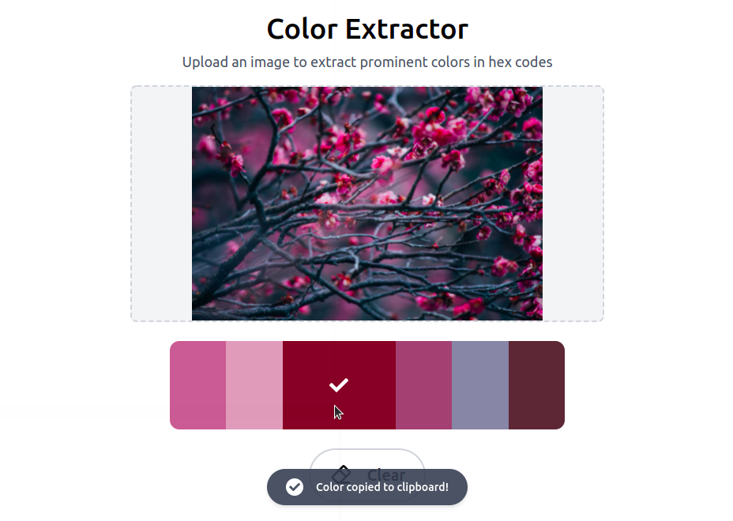

# Color Extractor

An app for extracting colors from images.

The [Color Extractor](https://mdesanker.github.io/color-extract) App

## Table of Contents

- [Description](#Description)
- [Motivation](#Motivation)
- [How to use](#How-to-use)
- [Built with](#Built-with)
- [Challenges](#Challenges)
- [Credits](#Credits)

## Description

This is a frontend app which uses React Palette to extract the prominent colors from images. Users upload images by drag-and-drop or browsing their file system, and then the colors are displayed in a palette (heavily inspired by [Coolors](https://coolors.co/palettes/trending)). Hovering over a color displays the hex code, and clicking the color will copy the hexcode to the clipboard.

## Motivation

The motivation for this project comes from the wanting to be able to extract colors from images that are saved on the users harddrive or images on webpages. The user can then easily hover of the color outputs in the palette to display their hex code, and click to copy the hex code to the clipboard.

## How to use

1. Drag-and-drop an image onto the drop area, or click drop area to browse files.


2. Hover color swatches on palette to view hex codes. Click to copy hex code to clipboard.


3. Click image or drag new image to drop area to process new image. Click clear button to remove current image.



## Built with

- TypeScript
- React
- Redux
- React Palette
- React Dropzone
- Tailwind CSS

## Challenges

1. Ensuring foreground and background color combinations provide sufficient contrast by [calculating the perceived brightness](https://www.nbdtech.com/Blog/archive/2008/04/27/Calculating-the-Perceived-Brightness-of-a-Color.aspx) of the background color.

First hex colors were converted into rgb colors with parseInt base 16:

```js
const hexCode = "045e8f";

const red = parseInt(hexCodesubstring(0, 2), 16);
const green = parseInt(hexCodesubstring(2, 4), 16);
const blue = parseInt(hexCodesubstring(4), 16);
```

Then these values were used to calculate brightness:

```js
const brightness = Math.round(red * 299 + green * 587 + blue * 114) / 1000);
```

If the color's brightness > 125, then the text is set to black, and if brightness < 125, text is set to white.

2. When colors in the palettes on [Coolors](https://coolors.co/palettes/trending) are hovered, they expand smoothly. I have not been able to figure out how to achieve this with Tailwind CSS yet.

## Credits

- Favicon: [Flaticons](https://www.flaticon.com/free-icon/color-palette_3214398?term=color&page=1&position=27&page=1&position=27&related_id=3214398&origin=search)
